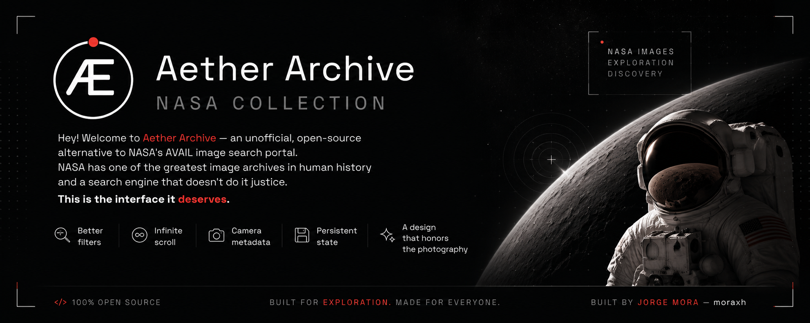

  

<h1 align="center">Aether Archive</h1>

  An unofficial, open-source alternative to NASA's AVAIL image search portal.

  Built to make exploring NASA's public image archive fast, immersive, and enjoyable.

---

## Overview

NASA hosts one of the most important public image archives ever created.  
The problem is that the current discovery experience does not reflect the quality of the material itself.

Aether Archive rethinks that experience from the ground up:

- Faster and cleaner exploration
- Better filtering and search behavior
- Infinite scrolling
- Persistent UI state
- Rich camera and mission metadata
- A modern interface focused on the photography

The goal is simple: create the browsing experience this archive deserves.

---

## What This Project Is

Aether Archive is a fully client-side interface built on top of NASA's public APIs.

It is focused on:

- Search and discovery
- Image exploration
- Metadata visualization
- Performance and usability
- Long browsing sessions without friction

---

## What This Project Is Not

This project is **not**:

- Affiliated with NASA
- Endorsed by NASA
- An official NASA product
- A replacement for NASA's archival infrastructure

All imagery, metadata, and related content belong to NASA and their respective creators.

Aether Archive only provides an alternative interface for accessing publicly available data.

---

## Architecture

The entire project is designed to remain lightweight and free.

### Stack

- Frontend-only architecture
- No backend
- No database
- No server-side processing
- Direct communication with NASA public APIs

### Deployment

- Hosted on Vercel
- Runs entirely on the free tier
- Zero infrastructure cost

Keeping the project free and sustainable is an important design constraint.  
Ideas and pull requests focused on optimization are always welcome.

---

## Contributing

Contributions are welcome.

Before opening a pull request, please read the [Contributing Guide](CONTRIBUTING.md) to stay aligned with the project's direction and design philosophy.

---

## Philosophy

Aether Archive is built around a simple belief:

> Historic imagery deserves an interface that respects it.

The archive already exists.  
The mission is to make exploring it feel effortless.

---

## Credits

Built by Jorge Mora  
GitHub: [@moraxh](https://github.com/moraxh)

---

## License

This project is open source.  
See the repository license for details.